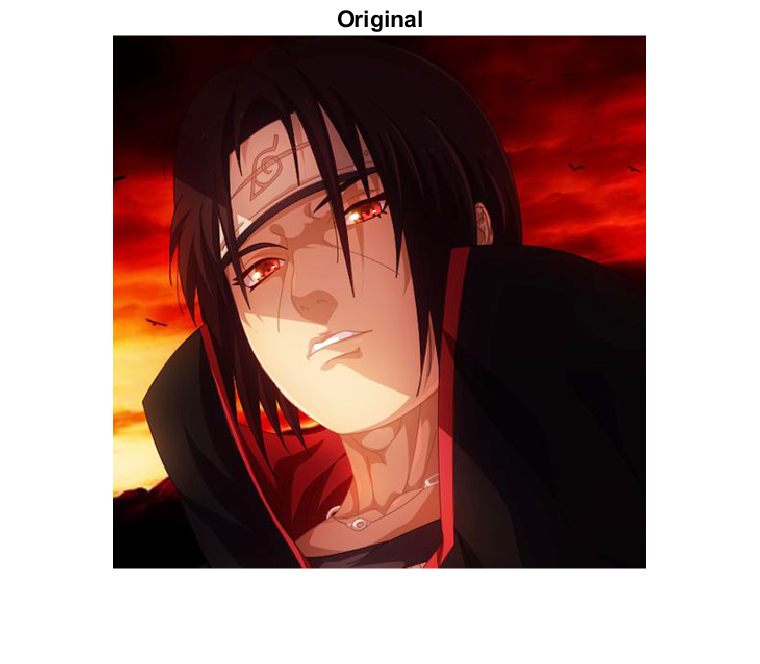
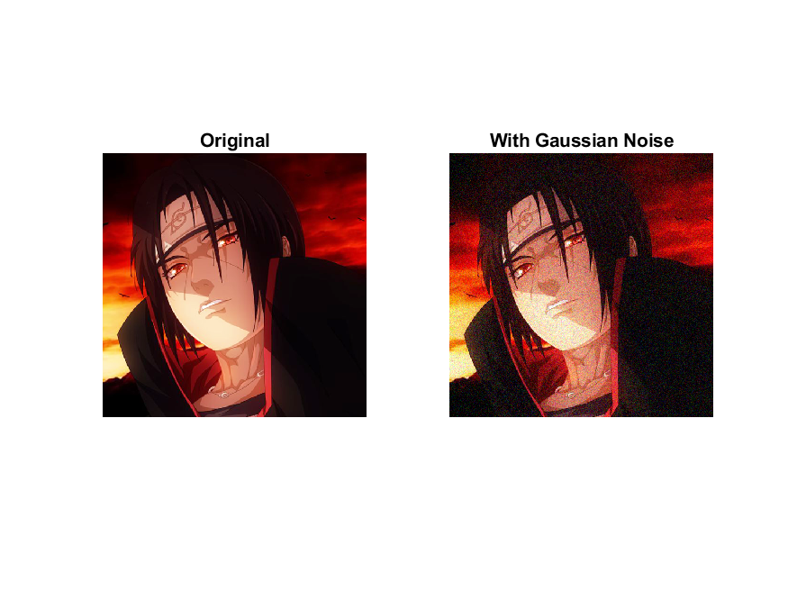
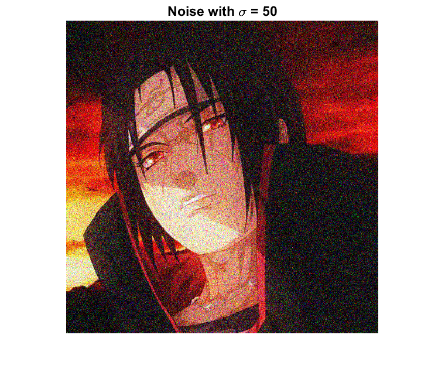
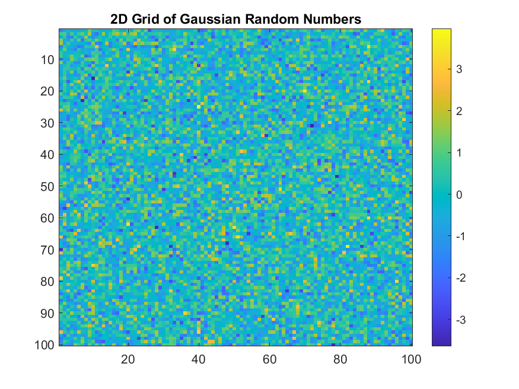
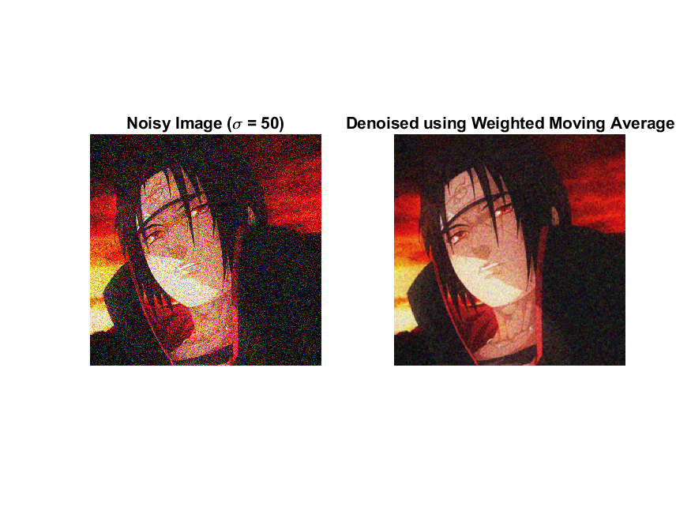
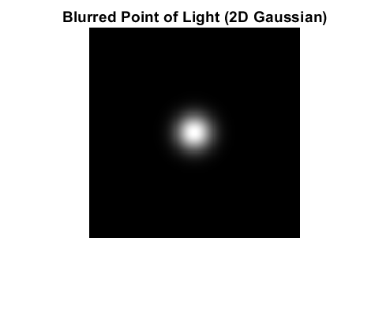
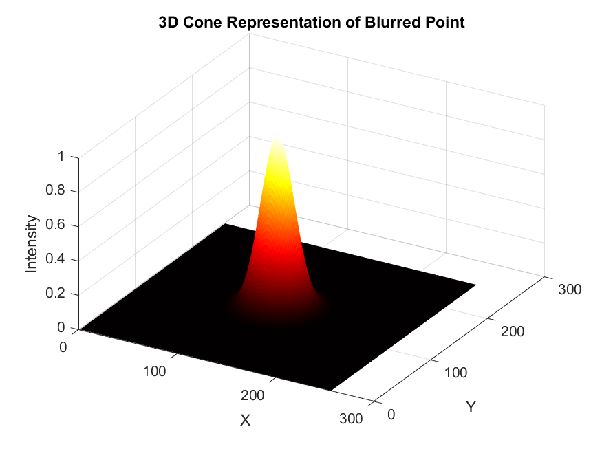
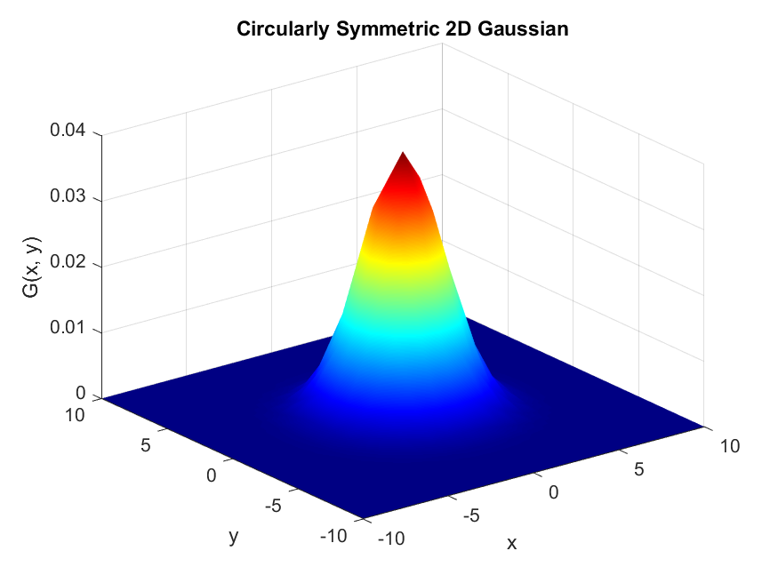

```matlab
addpath('C:\Users\havoc\OneDrive\Bilder\matlabwork\');
savepath;
itachi = imread('itachi.png');
img_small = imresize(itachi, 0.2);

% Save original and noisy images
figure;
imshow(itachi);
title('Original');
saveas(gcf, 'original_image.png');  % Save original image
```



```matlab

sigma = 20;
noise = randn(size(itachi)) .* sigma;
itachi_double = double(itachi);
output = itachi_double + noise;
output = uint8(min(max(output, 0), 255));
figure;
subplot(1,2,1); imshow(itachi); title('Original');
subplot(1,2,2); imshow(output); title('With Gaussian Noise');
saveas(gcf, 'noisy_image.png');  % Save noisy image
```



```matlab

% Noise with different sigma values
figure;
for sigma = [5, 20, 50]
    noise = randn(size(itachi)) * sigma;
    noisy = double(itachi) + noise;
    noisy = uint8(min(max(noisy, 0), 255));
    
    imshow(noisy);
    title(['Noise with \sigma = ' num2str(sigma)]);
    pause(2);
    saveas(gcf, ['noise_sigma_' num2str(sigma) '.png']); % Save images with different noise levels
end
```



```matlab

% Gaussian Distribution Histogram
illNoise = randn([1, 100]);
[n, x] = hist(illNoise, [-3 -2 -1 0 1 2 3]);
disp([x; n]);
```

```matlabTextOutput
    -3    -2    -1     0     1     2     3
     0     6    25    35    24    10     0
```

```matlab

figure;
bar(x, n, 1); 
title('Gaussian Distribution Histogram');
xlabel('Value');
ylabel('Frequency');
saveas(gcf, 'gaussian_histogram.png');  % Save histogram figure
```



```matlab

% 2D Grid of Gaussian Random Numbers
rows = 100;  
cols = 100;  
gaussianGrid = randn(rows, cols);
figure;
imagesc(gaussianGrid);
colorbar; 
title('2D Grid of Gaussian Random Numbers');
saveas(gcf, 'gaussian_grid.png');  % Save 2D grid figure
```



```matlab

% Noisy Image with Sigma = 50 and Denoised Image
sigma = 50;
noise = randn(size(itachi)) * sigma;
itachi_double = double(itachi);
noisy_img = itachi_double + noise;
noisy_img = uint8(min(max(noisy_img, 0), 255));

figure;
subplot(1, 2, 1);
imshow(noisy_img);
title('Noisy Image (\sigma = 50)');
saveas(gcf, 'noisy_image_sigma50.png');  % Save noisy image figure

h = fspecial('gaussian', [5 5], 1); 
denoised_img = zeros(size(noisy_img), 'uint8');
for c = 1:size(noisy_img, 3)
    denoised_img(:, :, c) = uint8(imfilter(noisy_img(:, :, c), h, 'replicate'));
end
subplot(1, 2, 2);
imshow(denoised_img);
title('Denoised using Weighted Moving Average');
saveas(gcf, 'denoised_image.png');  % Save denoised image figure
```



```matlab

% Blurred Point of Light (2D Gaussian) Visualization
imgSize = 256;
[x, y] = meshgrid(1:imgSize, 1:imgSize);
center = imgSize / 2;
sigma = 15; 
gauss = exp(-((x - center).^2 + (y - center).^2) / (2 * sigma^2));
gauss = gauss / max(gauss(:));

figure;
imshow(gauss, []);
title('Blurred Point of Light (2D Gaussian)');
saveas(gcf, 'blurred_point_of_light.png');  % Save blurred point image
```



```matlab

% 3D Cone Representation of Blurred Point
figure;
surf(gauss, 'EdgeColor', 'none');
colormap hot;
view(30, 40);
title('3D Cone Representation of Blurred Point');
xlabel('X'); ylabel('Y'); zlabel('Intensity');
saveas(gcf, '3D_cone_representation.png');  % Save 3D surface plot
```



```matlab

% Visualizing Gaussian Kernels
sigmas = [0.5, 1, 2, 4];  
figure;
for i = 1:length(sigmas)
    sigma = sigmas(i);
    h = fspecial('gaussian', [11 11], sigma);

    % Plot heatmap
    nexttile(i);
    imagesc(h);
    colormap hot;
    colorbar;
    axis equal tight;
    title(['Gaussian Kernel (\sigma = ' num2str(sigma) ')'], 'FontSize', 14);
    saveas(gcf, ['gaussian_kernel_sigma_' num2str(sigma) '.png']);  % Save Gaussian kernel images
end
```


```matlab

% Circularly Symmetric 2D Gaussian (Surface Plot)
[x, y] = meshgrid(-10:10, -10:10);
sigma = 2;
G = (1/(2*pi*sigma^2)) * exp(-(x.^2 + y.^2)/(2*sigma^2));

figure;
surf(x, y, G);
title('Circularly Symmetric 2D Gaussian');
xlabel('x'); ylabel('y'); zlabel('G(x, y)');
shading interp; colormap jet;
saveas(gcf, 'circularly_symmetric_gaussian.png');  % Save circular Gaussian surface plot
```


```matlab

% Visualizing the Two Sigmas
rows = 200; % image height
cols = 200; % image width
noise = randn(rows, cols); % Gaussian noise
sigmas = [0.5, 1, 2, 4];  % Different Gaussian sigmas for wider kernels
kernel_sizes = [3, 5, 7, 9]; % Different kernel sizes

figure;
for i = 1:length(sigmas)
    sigma = sigmas(i);
    h = fspecial('gaussian', kernel_sizes(i), sigma);  % Create Gaussian filter

    % Apply the Gaussian filter to the noise
    smoothed_noise = imfilter(noise, h, 'replicate');
    
    % Display the original noise and the smoothed result
    subplot(length(sigmas), 2, 2*i-1);
    imshow(noise, []); % Display the original noise
    title(['Original Noise (σ = ' num2str(sigma) ')']);
    
    subplot(length(sigmas), 2, 2*i);
    imshow(smoothed_noise, []); % Display the smoothed noise
    title(['Smoothed Noise (Kernel = ' num2str(kernel_sizes(i)) 'x' num2str(kernel_sizes(i)) ')']);
    saveas(gcf, ['smoothed_noise_sigma_' num2str(sigma) '.png']);  % Save smoothed noise figures
end
```


```matlab

% Saving data to .mat file
save('project_data.mat', 'itachi', 'img_small', 'output', 'noisy_img', 'denoised_img', 'gauss', 'G', 'noise');

```
