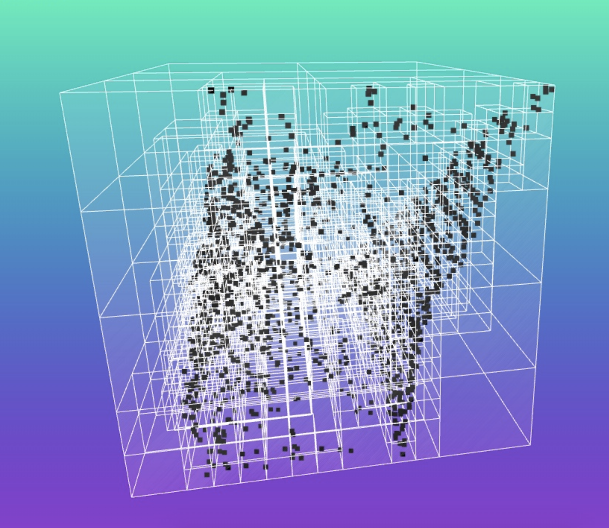

# Octomap Approach in SLAM

An **Octomap approach** in **SLAM (Simultaneous Localization and Mapping)** is a technique used to create a **3D map** of the environment by representing it as a set of **occupied, free, and unknown spaces**. It utilizes an **octree data structure** to efficiently manage **3D spatial information**. This approach is particularly useful for **robotic systems** that need to navigate in complex, dynamic, and unstructured environments.

---

## 🔑 Key Concepts

### 📌 Octree Structure
An **octree** is a hierarchical data structure where the space is recursively divided into smaller cubes (called "**octants**").  
Each node in the tree represents a **cubic region** in 3D space, and the **size of each cube** can vary depending on the **resolution** of the map.

### 📌 Occupancy Grid
Instead of using traditional **2D occupancy grids**, **Octomap** uses **3D grids**, allowing the map to represent **not only the floor** but also the **height and obstacles** in the environment.

### 📌 Probabilistic Representation
Octomap employs a **probabilistic method** to represent the occupancy of each **voxel (volume element)**.  
Each voxel has a **probability value** indicating whether it is **occupied or free**, which is continuously updated based on **sensor data** (such as **LiDAR** or **RGB-D cameras**).

### 📌 Efficient 3D Mapping
Octomap allows robots to efficiently map **large-scale 3D environments** while using **limited memory**.  
Only **occupied regions** are represented in **detail**, while **free space** is encoded at a **coarser resolution**.

---

## 🚀 Benefits of Octomap in SLAM

✅ **Real-Time Performance** → Optimized for real-time applications like **mobile robots, drones, and autonomous vehicles**.  
✅ **Scalability** → Hierarchical structure allows it to **scale well** in **large environments**.  
✅ **Dynamic Environments** → Can handle **moving objects** and **environmental changes**.  
✅ **Flexibility** → Easily integrates with existing **SLAM** systems for **2D & 3D mapping**.

---

## 🏆 Common Applications

- 🤖 **Autonomous Robotics** → Used in **mobile robots** for **detailed 3D mapping** & **navigation**.  
- 🚁 **Drones** → Helps in **aerial mapping** and **real-time obstacle avoidance**.  
- 🕶 **Augmented Reality (AR)** → Enables **environment mapping** for **AR applications**.

---

## 🗺 Visual Representation of an Octomap

Below is a **visual representation** of an **Octomap**, utilizing an **octree** with a **hierarchical structure** to create a **3D occupancy grid**.  
It only tracks **occupied spaces in detail**, while **free voxels (singular cube units)** are encoded efficiently.

